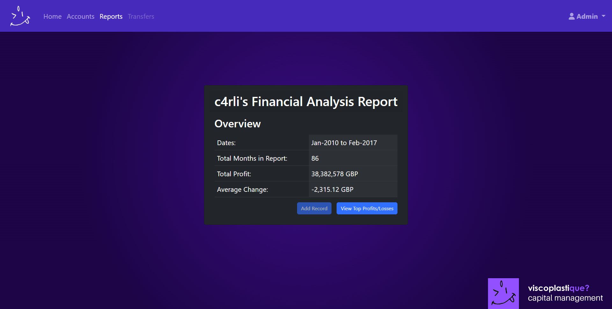
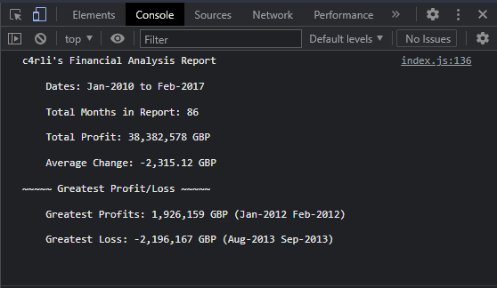

# Bootcamp Challenge 4 Financial Console
A simple application written in JavaScript that makes financial calculations from a 2D array.
With additional UI written in HTML and CSS.

## Description
This repo contains source code for simple webpage that displays output from calculations carried out on preloaded array.
Deployed webpage can be found below.

### My User Story:
```
You have been given a dataset composed of arrays with two fields: Date and Profit/Losses.
Your task is to write JavaScript code that analyzes the records to calculate each of the following:
- The total number of months included in the dataset.
- The net total amount of Profit/Losses over the entire period.
- The average of the changes in Profit/Losses over the entire period.
- You will need to track what the total change in profits is from month to month and then find the average. (Total/Number of months)
- The greatest increase in profits (date and amount) over the entire period.
- The greatest decrease in losses (date and amount) over the entire period.
```

### Features:
- Performs calculations on webpage load to console.
- Updates values on HTML page.
- 2 views on webpage. (Overview + Profits/Losses)

### Preview of webpage:

## Preview of console:


## Installation
N/A

## Usage
Deployed webpage can be found here:  [viscoplastique? capital management - Reports](https://c4rli.github.io/Bootcamp-Challenge-4-Console-Finances/)

## Credits
Source code written by carli n. aka c4rli ++

## License
Please refer to the LICENSE in the repo.